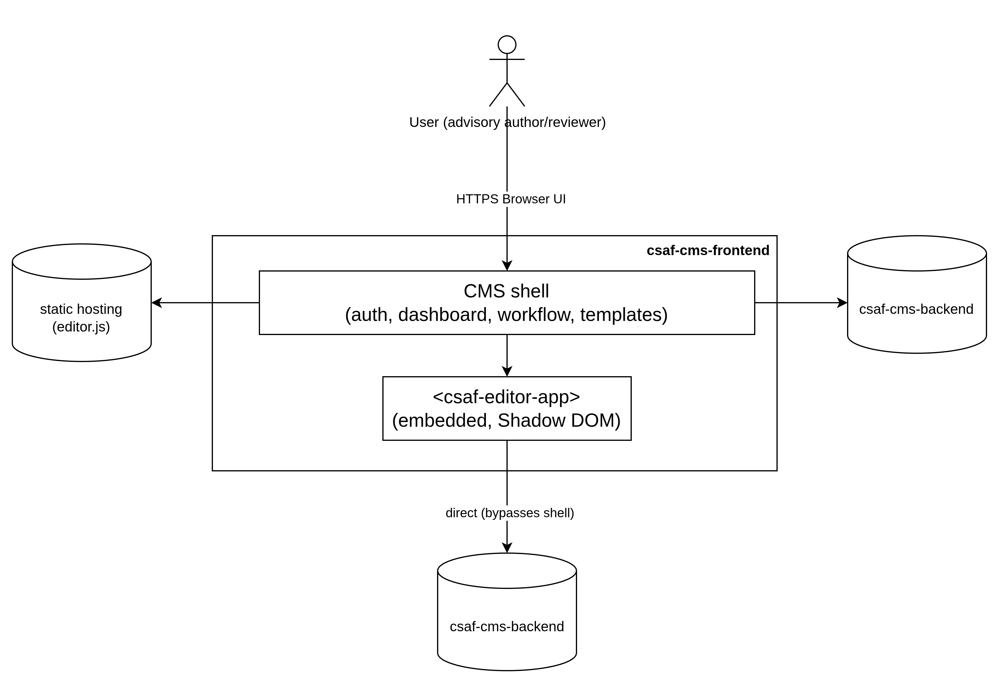
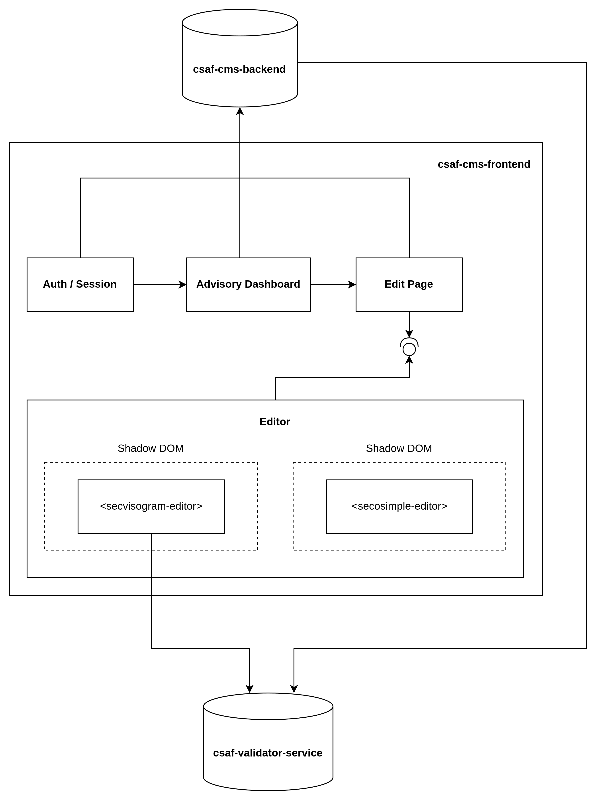
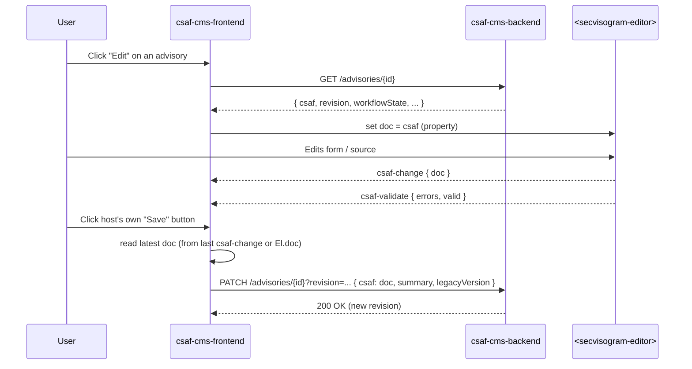
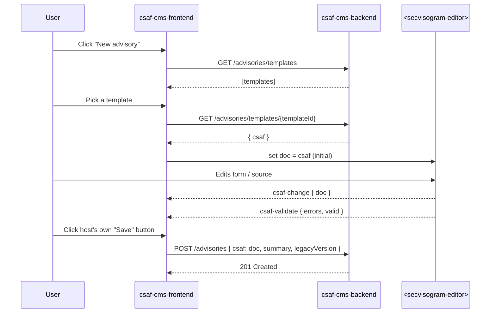
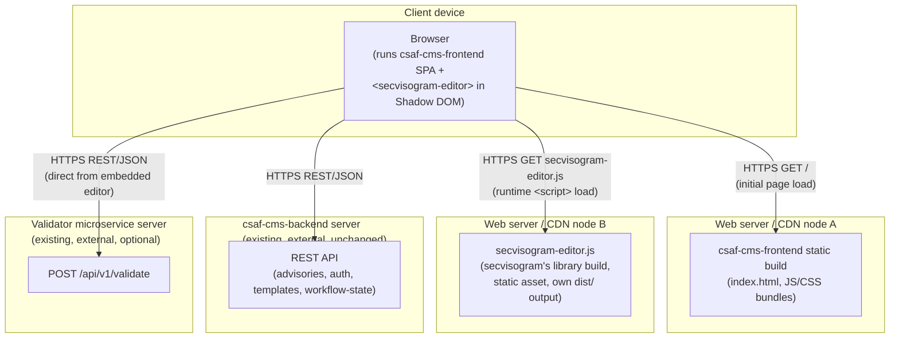

# csaf-cms-frontend

## Introduction & Goals

The csaf-cms-frontend is the web-based user interface for managing CSAF security advisories in the CSAF CMS. It lets users create, edit, and review advisories through a guided workflow, embedding the secvisogram editor as a self-contained custom element (<secvisogram-editor>) for form- and source-based CSAF editing. The application is implemented as a single-page application in TypeScript, React, and Tailwind CSS, using client-side routing (react-router) and communicating with the csaf-cms-backend over its REST API for advisory storage, templates, and workflow state.

## Constraints

### Technical Constraints

| Constraint                                                                       | Explanation                                                                                                                                                                                                                                                                              |
| -------------------------------------------------------------------------------- | ---------------------------------------------------------------------------------------------------------------------------------------------------------------------------------------------------------------------------------------------------------------------------------------- |
| Stack: TypeScript, React, Tailwind CSS                                           | Chosen to match secvisogram's own stack, easing embedding of a React-authored custom element and sharing tooling/knowledge (CONCEPT.md §1).                                                                                                                                              |
| Single-page application, client-side routing                                     | Must use react-router for navigation; no server-side routing.                                                                                                                                                                                                                            |
| Editor is embedded only as `<secvisogram-editor>` custom element in a Shadow DOM | The editor is out-of-tree, framework/version-independent, and must be treated as a replaceable black box addressed only via its documented properties (`doc`, `schemaVersion`, `locale`, `validatorUrl`) and events (`csaf-change`, `csaf-validate`); never via direct imports/coupling. |
| No build-time dependency on secvisogram                                          | The editor bundle (`secvisogram-editor.js`) is loaded at runtime via a static `<script>` tag from wherever it's hosted (own static assets or CDN), not as an npm package.                                                                                                                |
| No direct network edge from the embedded editor to csaf-cms-backend              | csaf-cms-frontend must own 100% of backend/auth calls (session, dashboard, CRUD, workflow, templates); the only exception is the editor's own direct call to the separate validator microservice.                                                                                        |
| CSS isolation via Shadow DOM                                                     | Host and editor styles (Tailwind) should leak across the shadow boundary in either direction. (Some CSS properties are inherited e.g. `color` or custom properties)                                                                                                                      |

### Organizational / Political Constraints

| Constraint                                       | Explanation                                                                                                                                                                                  |
| ------------------------------------------------ | -------------------------------------------------------------------------------------------------------------------------------------------------------------------------------------------- |
| Split of responsibility between two repositories | `csaf-cms-frontend` (this repo, CMS shell/auth/dashboard) and secvisogram (pure, backend-free editor) are maintained as separate codebases/release cycles by design — not a temporary state. |

### Conventions

| Convention                   | Explanation                                                                    |
| ---------------------------- | ------------------------------------------------------------------------------ |
| Prettier for code formatting | Matches formatting conventions used across the other secvisogram-family repos. |
| MIT license                  | Matches the other projects in the ecosystem.                                   |

## Context and Scope

### Context diagram

### Business context

Domain-level interactions — what data/intent crosses the system boundary, independent of protocol:

| Communication partner           | Interaction                                                                                                                                                                                                                         |
| ------------------------------- | ----------------------------------------------------------------------------------------------------------------------------------------------------------------------------------------------------------------------------------- |
| User (advisory author/reviewer) | Logs in; browses/creates/edits/deletes advisories; changes workflow state (Draft → Review → Published); picks a template; edits the CSAF document itself (delegated to the embedded editor); triggers Save.                         |
| csaf-cms-backend                | Authoritative store of advisories (CSAF doc and metadata: id, revision, workflow state, owner) and templates; owns login/session and permission/role decisions; the sole system of record the frontend must read from and write to. |

### Technical context

Channels, protocols, and interfaces:

| Communication partner                                    | Channel / protocol                                                                       | Interface                                                                                                                                                                                                                                                                 |
| -------------------------------------------------------- | ---------------------------------------------------------------------------------------- | ------------------------------------------------------------------------------------------------------------------------------------------------------------------------------------------------------------------------------------------------------------------------- |
| User's browser                                           | HTTPS, rendered UI                                                                       | Single-page app, client-side routed with react-router.                                                                                                                                                                                                                    |
| csaf-cms-backend                                         | HTTPS, REST, JSON                                                                        | `POST/GET /advisories`, `GET/PATCH/DELETE /advisories/{id}`, `PATCH /advisories/{id}/workflowstate/{state}`, `PATCH /advisories/{id}/createNewVersion`, `GET /advisories/templates`, `GET /advisories/templates/{templateId}`, `GET /advisories/{id}/csaf`, `GET /about`. |
| App-config discovery                                     | HTTPS, JSON (well-known endpoint)                                                        | `GET /.well-known/appspecific/de.bsi.secvisogram.json` → `loginAvailable`/`loginUrl`/`logoutUrl`/`userInfoUrl` (consumed by csaf-cms-frontend) and `validatorUrl` (passed through as a property to the embedded editor).                                                  |
| `<secvisogram-editor>` bundle host (CDN / static assets) | HTTPS, static `<script>` tag                                                             | `secvisogram-editor.js`, loaded at runtime, no build-time coupling; registers the custom element via `customElements.define`.                                                                                                                                             |
| `<secvisogram-editor>` (embedded custom element)         | In-process, JS properties/DOM events (no network)                                        | Properties in: `doc`, `schemaVersion`, `locale`, `validatorUrl`. Events out: `csaf-change { doc }`, `csaf-validate { errors, valid }`.                                                                                                                                    |
| Validator microservice                                   | HTTPS, REST, JSON — **called directly by the embedded editor, not by csaf-cms-frontend** | `POST {validatorUrl}/api/v1/validate`. Included here because it's reachable from within the system's UI, even though csaf-cms-frontend itself never talks to it directly.                                                                                                 |

Note: csaf-cms-backend is explicitly out of scope for this system (external, unchanged — see CONCEPT.md); csaf-cms-frontend's job is to be a complete, correct client against its existing API surface, not to influence its design.

## Solution Strategy

### Key decisions

- **Technology**: TypeScript, React, and Tailwind CSS — chosen to match secvisogram's own stack, minimizing friction when embedding a React-authored custom element and letting both repos share tooling/conventions.
- **Top-level decomposition**: Split the former monolithic secvisogram app into two independently deployable systems along a domain seam — CMS concerns (auth, dashboard, workflow, templates) vs. pure CSAF-document editing. The two communicate only through a narrow, versioned **custom-element contract** (`<secvisogram-editor>`: properties in, DOM events out), never through shared imports or runtime state — this is effectively a "micro-frontend via Web Components" pattern, not a shared React tree.
- **Runtime, not build-time, integration**: The editor bundle is loaded via a static `<script>` tag at runtime rather than an npm dependency, so the two repos can be built, versioned, and released independently.
- **Ownership of backend access**: All csaf-cms-backend/auth calls are centralized in csaf-cms-frontend; the embedded editor is deliberately backend-free (one narrow exception: it calls the external validator microservice directly).
- **Organizational**: csaf-cms-backend is treated as a fixed, externally-owned dependency; no new backend endpoints are assumed, so this system must be built entirely against today's existing API surface.

### Quality goals

| Quality goal                                                 | Scenario                                                                                 | Solution approach                                                                                                                                                             |
| ------------------------------------------------------------ | ---------------------------------------------------------------------------------------- | ----------------------------------------------------------------------------------------------------------------------------------------------------------------------------- |
| Reusability / replaceability of the editor                   | Another editor interface is developed and shall be integrated into the csaf-cms-frontend | Editor packaged as a self-contained Shadow-DOM custom element with only a `doc`/`schemaVersion`/`locale`/`validatorUrl` and event contract, no CMS-domain knowledge inside it |
| Security / minimal trust surface for third-party editor code | Editor must never see CMS session cookies/tokens or call the backend itself              | csaf-cms-frontend owns 100% of auth/session and all backend calls; editor has zero network edge to csaf-cms-backend                                                           |
| Style isolation                                              | Host and editor use independent Tailwind builds that must not clash                      | Shadow DOM boundary with `adoptedStyleSheets`-based CSS injection into the shadow root                                                                                        |
| Independent release cadence / maintainability                | Editor and CMS shell evolve at different speeds without cross-repo coordination overhead | Two separate repositories, no build-time dependency; editor loaded at runtime via `<script>` tag                                                                              |
| Low integration risk against an unchanging backend           | csaf-cms-backend cannot be modified for this project                                     | Build entirely against the existing, documented API surface (advisories CRUD, workflow-state, templates)                                                                      |

## Building Block View

## Runtime View

### Sequence: open an existing advisory for editing

### Sequence: create a new advisory

## Deployment View

### Deployment diagram (production)

### Mapping of building blocks to infrastructure

| Building block                                                     | Infrastructure node                                                               | Notes                                                                                                                                                                                        |
| ------------------------------------------------------------------ | --------------------------------------------------------------------------------- | -------------------------------------------------------------------------------------------------------------------------------------------------------------------------------------------- |
| csaf-cms-frontend (CMS shell: auth, dashboard, edit-advisory page) | Web server / CDN node A, served statically                                        | Built as a static SPA bundle (Vite), same "build once, serve via nginx/CDN" pattern as secvisogram today; no server-side runtime component.                                                  |
| `<secvisogram-editor>` bundle (`secvisogram-editor.js`)            | Web server / CDN node B (can be co-located with node A, or a separate origin/CDN) | Produced by secvisogram's own build pipeline as a new library/custom-element target, deployed independently of csaf-cms-frontend — no build-time coupling, loaded at runtime via `<script>`. |
| csaf-cms-backend                                                   | Existing, externally operated backend server                                      | Out of scope for this system's deployment; only its API surface is a dependency.                                                                                                             |
| Validator microservice                                             | Existing, externally operated server (separate origin)                            | Optional; only reachable if `validatorUrl` is configured; called directly by the embedded editor, not proxied through csaf-cms-frontend.                                                     |

### Environments

| Environment | Difference from production                                                                                                                                                                                                                                                                                                                                           |
| ----------- | -------------------------------------------------------------------------------------------------------------------------------------------------------------------------------------------------------------------------------------------------------------------------------------------------------------------------------------------------------------------- |
| Development | Vite dev server (`npm run dev`-style) with hot reload; `secvisogram-editor.js` likely loaded from a local secvisogram dev build or a dev/staging static host; backend/validator URLs point at dev/staging instances.                                                                                                                                                 |
| Production  | Static build artifacts only (no framework dev server); served behind a hardened webserver (TLS, HSTS, CSP, `X-Frame-Options`, etc. — see the nginx template already documented for secvisogram in DEVELOPMENT.md); CSP `script-src`/`connect-src` must explicitly allow the origin(s) hosting `secvisogram-editor.js` and the configured `validatorUrl`/backend API. |

**Cross-cutting note for later Section 8**: since the editor bundle and its CSP-relevant origins are now a runtime dependency rather than a build-time one, csaf-cms-frontend's Content-Security-Policy needs deliberate `script-src`/`style-src`/`connect-src` entries for wherever `secvisogram-editor.js` and the validator service are hosted — worth flagging explicitly once those origins are finalized.

## Crosscutting Concepts

### Custom-Element Embedding Concept

The most cross-cutting concept in this system: csaf-cms-frontend treats the editor exclusively as an opaque custom element (`<secvisogram-editor>`), never as a shared React component tree or importable library. It touches Building Block View (the editor is a single black-box node), Runtime View (every sequence crosses this boundary only via properties/events), Constraints (the `doc`/`schemaVersion`/`locale`/`validatorUrl` properties and `csaf-change`/`csaf-validate` events), and Deployment View (the bundle is loaded at runtime from a separately built/hosted origin). Any change to this contract must be versioned and coordinated across both repositories.

Rules:

- The host may only communicate through the documented properties/events; never by reaching into the shadow root's internals.
- Property writes on a freshly created element must wait for `customElements.whenDefined('secvisogram-editor')`, otherwise writes risk being lost on an un-upgraded element.
- Re-setting `doc` always means "load a new document" (resets internal state/undo history) — never an incremental patch; incremental edits only ever flow host-ward via `csaf-change`.

### Security Concept

- **Auth/session ownership** is 100% centralized in csaf-cms-frontend; the embedded editor never receives cookies/tokens and never calls csaf-cms-backend directly.
- **Content-Security-Policy**: `script-src`/`connect-src`/`style-src` must explicitly allowlist the origin(s) serving `secvisogram-editor.js` and `validatorUrl`; otherwise follow the CSP/HSTS/`X-Frame-Options` hardening template already used for secvisogram (see `DEVELOPMENT.md` in the secvisogram repo).
- The editor's one direct external call (to the validator microservice) is a deliberate, narrowly scoped exception.
- **XSS mitigation**: rely on React's JSX auto-escaping throughout; `dangerouslySetInnerHTML` (or equivalent) is only permitted where a component genuinely needs raw HTML (e.g. CSAF preview rendering) and only after explicit sanitization.

### Style Isolation Concept

Shadow DOM is used exclusively to isolate CSS between host and editor. Prefer `adoptedStyleSheets` (a single constructed stylesheet, shareable across multiple mounted editor instances) over an inlined `<style>` tag, for both the editor's own Tailwind output and Monaco's editor CSS. A small set of CSS properties are inherited across shadow boundaries by the platform itself (e.g. `color`, custom properties/CSS variables). This is the only intentional styling channel across the boundary; any other property crossing it is treated as a leak/bug, not a feature.

**Caveat**: this inherited-property leakage (e.g. `color`) only exists because the _editor's_ shadow root is nested inside a normal, light-DOM `csaf-cms-frontend` page. Wrapping csaf-cms-frontend itself in its own shadow root would additionally block that inheritance, giving fully symmetric isolation. This was considered and rejected. See ADR 4's "Alternative considered" note because it does not combine well with react-router's assumptions about `document`-rooted routing.

### Validation Concept

Two independent, complementary validation layers, both owned entirely by the embedded editor:

1. Always-on client-side JSON Schema validation (AJV), debounced ~300ms after edits or triggered on tab change.
2. Optional server-side validation against the separate validator microservice (`POST {validatorUrl}/api/v1/validate`), only available if `validatorUrl` is configured.

Both layers report into the same `csaf-validate { errors, valid }` event, so csaf-cms-frontend's Save button/validity indicator only ever consumes this single boolean/error-list signal. It must not attempt to interpret CSAF-domain validation error paths itself.

### Internationalization Concept

The embedded editor bundles its own independent i18next instance and dictionaries (no runtime locale fetch) and only ever receives a `locale` property from the host. It never reports its translation state back. csaf-cms-frontend therefore maintains its own, entirely separate i18n stack for CMS-shell strings (login, dashboard, workflow) and only passes a matching locale code across the boundary; string content is never shared or overridden across it.

### Error Handling & User Feedback Concept

A single, consistent notification/toast pattern is used across the CMS shell for both backend-call failures (network errors, 4xx/5xx from csaf-cms-backend) and success confirmations (e.g. "Advisory saved"). Errors and notifications originating inside the embedded editor (export success/failure, validation-summary toasts, template-load errors) surface only within its own shadow root and are out of csaf-cms-frontend's responsibility. The host's toast system only ever reacts to the `csaf-validate` event and to its own backend-interaction outcomes, never to editor-internal state.

## Architecture decisions

| #   | Title                                                             | Status     |
| --- | ----------------------------------------------------------------- | ---------- |
| 1   | Micro-frontend via Web Component instead of iframe or monolith    | Accepted   |
| 2   | Runtime `<script>` loading instead of a build-time npm dependency | To discuss |
| 3   | Centralize all backend/auth access in csaf-cms-frontend           | Accepted   |
| 4   | Shadow DOM + `adoptedStyleSheets` for CSS isolation               | Accepted   |
| 5   | React/TypeScript/Tailwind to match secvisogram's existing stack   | Accepted   |

### ADR 1: Micro-frontend via Web Component instead of iframe or monolith

**Context**: secvisogram today is a single monolithic SPA mixing CMS concerns (auth, dashboard, workflow) with pure CSAF-document editing. The target is splitting these into two independently maintained/released codebases, while letting csaf-cms-frontend still present the editor inline as part of one page. Candidate integration mechanisms: (a) keep one monolith and only refactor internally, (b) embed the editor via an `<iframe>`, (c) share a React component tree/library across repos, (d) a Shadow-DOM custom element with a properties/events contract.

**Decision**: Use a Shadow-DOM custom element (`<secvisogram-editor>`) with a narrow properties-in/events-out contract, as summarized in Solution Strategy.

**Consequences**:

- Positive: the editor is framework-version-independent from its host (no shared React tree/version to keep in lockstep) and trivially replaceable by a future alternative editor implementing the same contract.
- Positive: avoids `<iframe>` downsides that would otherwise apply here; no double-scrollbar/layout-sizing friction, no `postMessage` serialization boilerplate for every interaction, and DOM-level Shadow DOM CSS isolation instead of two entirely separate documents.
- Negative: any change to the `doc`/`schemaVersion`/`locale`/`validatorUrl` properties or `csaf-change`/`csaf-validate` events is a cross-repo breaking change with no compiler to catch it (tracked as risk #1 in Risks and Technical Debt).
- Negative: staying with one monolith (option a) would have avoided this contract-versioning risk entirely, at the cost of not achieving independent release cadence/ownership, which was the primary driver for this project.

### ADR 2: Runtime `<script>` loading instead of a build-time npm dependency

**Context**: Once the editor is a separate custom element, csaf-cms-frontend still needs to obtain and instantiate it. Candidates: publish it as a versioned npm package and depend on it at build time, or load the built bundle at runtime via a `<script>` tag from wherever it's hosted (own static assets or CDN).

**Decision**: Load `secvisogram-editor.js` at runtime via a plain `<script>` tag; no npm/build-time dependency between the repositories (Solution Strategy, Deployment View).

**Consequences**:

- Positive: the two repos can be built, versioned, and deployed on fully independent schedules; a new editor build can ship without a csaf-cms-frontend release, and vice versa.
- Positive: no shared bundler/toolchain coupling (webpack vs. Vite, etc.) between the two repos.
- Negative: no compile-time type checking of the embedding contract; a mismatched runtime version is only caught by manual/E2E testing (same risk #1 as ADR 1).
- Negative: the editor's origin becomes a runtime CSP dependency (`script-src`/`connect-src` must allowlist it — see Deployment View's cross-cutting note and the Security Concept) that an npm dependency would not have introduced.

### ADR 3: Centralize all backend/auth access in csaf-cms-frontend

**Context**: The former monolith called the CSAF CMS backend from many places throughout the editor UI. With the split, some component needs to own auth/session and every backend call. Candidates: let the embedded editor keep some backend calls itself (e.g. save/workflow-state) with csaf-cms-frontend only handling auth, or centralize all backend/auth calls in csaf-cms-frontend and make the editor entirely backend-free.

**Decision**: csaf-cms-frontend owns 100% of auth/session and backend calls; the embedded editor has zero network edge to csaf-cms-backend (Solution Strategy; Security Concept). The one deliberate exception is the editor's own direct call to the separate validator microservice, which is not the CMS backend.

**Consequences**:

- Positive: the editor never receives cookies/tokens, minimizing the trust surface of third-party/embedded editor code (see Quality goals table, "Security / minimal trust surface").
- Positive: a single, consistent place to reason about auth, permissions, and API error handling.
- Negative: every interaction that needs persisted data (save, workflow-state change, template load) must round-trip through the host via properties/events rather than being handled locally by the editor, which is why the Save button and its version/summary dialog have to move out of the editor and into csaf-cms-frontend.

### ADR 4: Shadow DOM + `adoptedStyleSheets` for CSS isolation

**Context**: Both host and editor use independent Tailwind builds that must not clash, and the editor also embeds Monaco (which ships its own CSS). Candidates considered: CSS namespacing/BEM conventions without any DOM boundary, an inlined `<style>` tag per shadow root, or a single constructed stylesheet shared across instances via `adoptedStyleSheets`.

**Decision**: Use Shadow DOM for the boundary itself, with `adoptedStyleSheets` preferred over an inlined `<style>` tag for injecting the editor's (and Monaco's) CSS into each shadow root (Style Isolation Concept).

**Consequences**:

- Positive: true style isolation in both directions.
- Positive: a single constructed stylesheet can be shared across multiple mounted editor instances without duplicating CSS text per instance, unlike an inlined `<style>` tag.
- Neutral: a small, fixed set of CSS properties (e.g. `color`, custom properties/CSS variables) still inherit across the shadow boundary by platform design — treated as the only intentional styling channel, any other leakage is a bug.

**Alternative considered**: csaf-cms-frontend itself could additionally be mounted inside its own shadow root, so that even those platform-inherited properties (`color`, custom properties/CSS variables) stop leaking into the editor — closing the one gap left open by the Neutral point above. This was rejected: react-router (client-side routing, `history`/`location` handling, `<Link>`/`<a>` navigation) assumes it is operating against the main `document`, and does not work well once the app root itself is relocated into a shadow tree.

### ADR 5: React/TypeScript/Tailwind to match secvisogram's existing stack

**Context**: csaf-cms-frontend is a new repository/codebase, free to pick any stack. secvisogram (the editor being embedded) is an existing React/Tailwind codebase.

**Decision**: Build csaf-cms-frontend with the same stack — TypeScript, React, Tailwind CSS (Constraints; Solution Strategy).

**Consequences**:

- Positive: eases embedding a React-authored custom element and lets both repos share tooling, linting, and team knowledge.
- Positive: lowers onboarding cost for engineers already familiar with secvisogram.
- Negative: both repos independently track React/Tailwind upgrades with no shared version pin — an upgrade in one repo does not imply the other stays compatible (tracked as risk #2 in Risks and Technical Debt).
- Negative: forgoes evaluating an alternative stack that might otherwise suit the CMS-shell's simpler UI needs (no Shadow DOM/Monaco requirements on this side), in favor of ecosystem consistency.

## Quality Requirements

## Risks and Technical Debt

Ordered by priority (highest first):

| #   | Risk / Technical Debt                                                               | Impact                                                                                                                                                                                                                                                                                        | Suggested mitigation                                                                                                                                                                                                          |
| --- | ----------------------------------------------------------------------------------- | --------------------------------------------------------------------------------------------------------------------------------------------------------------------------------------------------------------------------------------------------------------------------------------------- | ----------------------------------------------------------------------------------------------------------------------------------------------------------------------------------------------------------------------------- |
| 1   | No contract-versioning/compatibility check across the custom-element boundary       | Because the two repos are released independently with no build-time coupling, a breaking change to the `doc`/`schemaVersion`/`locale`/`validatorUrl` properties or `csaf-change`/`csaf-validate` events on either side can silently break production with no compiler/type-check catching it. | Version the embedding contract explicitly (e.g. a documented contract version, or a runtime capability/version property on the element); add integration/E2E tests that pin against a specific `secvisogram-editor.js` build. |
| 2   | React and Tailwind CSS as core third-party dependencies, outside the team's control | The whole UI is built on React and styled with Tailwind CSS; upstream breaking changes, deprecations, or end-of-support timelines for either are dictated by their respective upstream projects, not by this team.                                                                            | Pin and deliberately review React and Tailwind version upgrades (e.g. via Dependabot, as already used in secvisogram); track both projects' release/support roadmaps.                                                         |
| 3   | Bundle duplication / bootstrap performance                                          | csaf-cms-frontend and `secvisogram-editor.js` are built independently (no shared build-time dependency), so React, Tailwind runtime, and other common libraries are likely duplicated across both bundles, increasing total transferred JS and first-load time (Monaco alone is sizeable).    | Measure combined payload size early; consider caching/CDN strategy, lazy-loading `secvisogram-editor.js` only when the edit-advisory page is reached.                                                                         |

## Glossary

| Term | Definition       |
| ---- | ---------------- |
| CCF  | CSAF CMS Backend |
