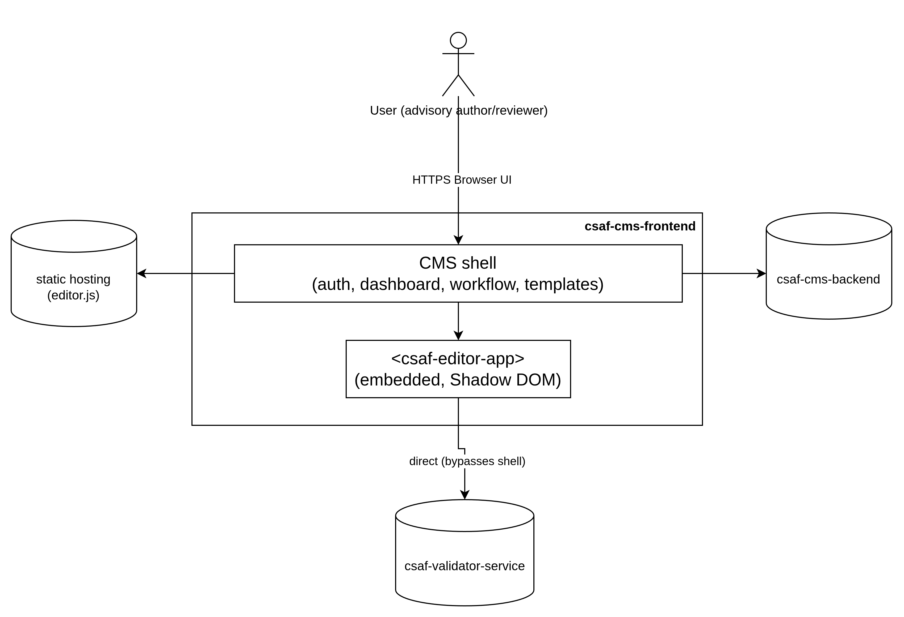
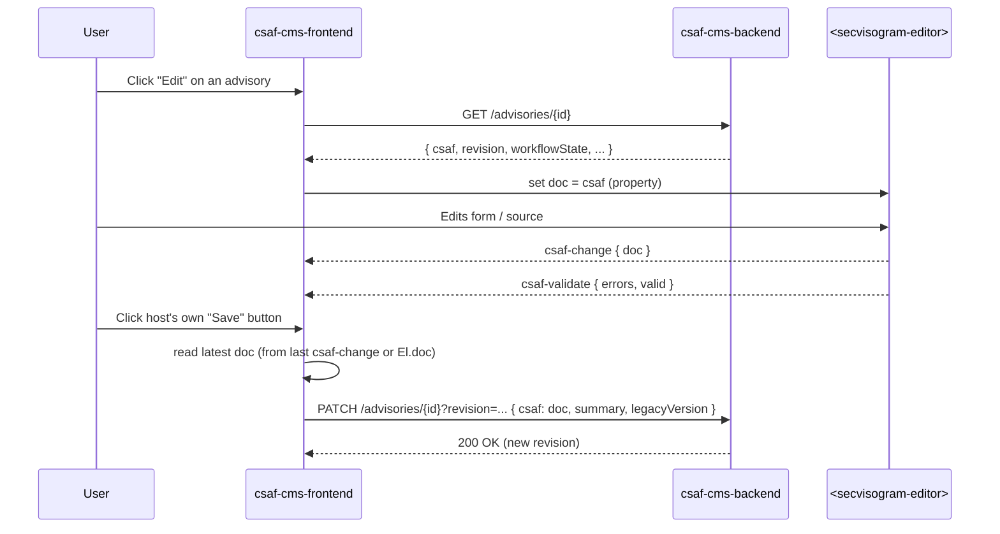
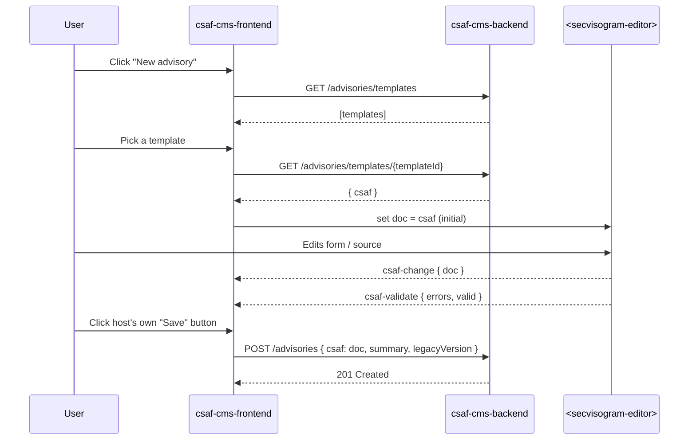
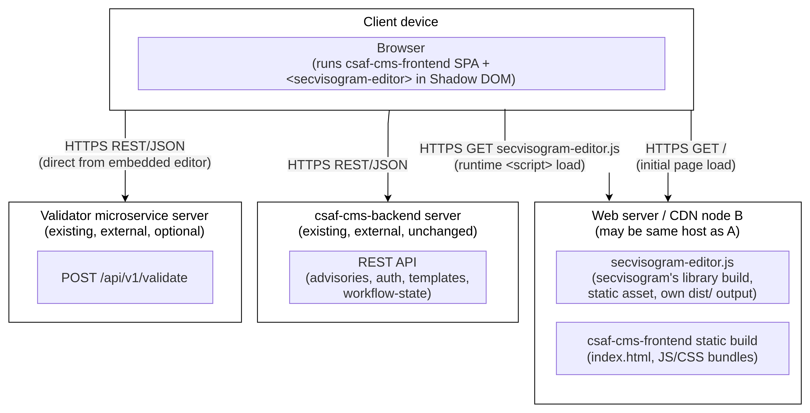

# csaf-cms-frontend

## Introduction & Goals

The csaf-cms-frontend is the web-based user interface for managing CSAF security advisories in the CSAF CMS. It lets users create, edit, and review advisories through a guided workflow, embedding the secvisogram editor as a self-contained custom element (`<secvisogram-editor>`) for form- and source-based CSAF editing. The application is implemented as a single-page application in TypeScript, React, and Tailwind CSS, using client-side routing (react-router) and communicating with the csaf-cms-backend over its REST API for advisory storage, templates, and workflow state.

## Constraints

### Technical Constraints

| Constraint                                                                       | Explanation                                                                                                                                                                                                                                                             |
| -------------------------------------------------------------------------------- | ----------------------------------------------------------------------------------------------------------------------------------------------------------------------------------------------------------------------------------------------------------------------- |
| Stack: TypeScript, React, Tailwind CSS                                           | Chosen to match secvisogram's own stack.                                                                                                                                                                                                                                |
| Single-page application, client-side routing                                     | Must use react-router for navigation; no server-side routing.                                                                                                                                                                                                           |
| Editor is embedded only as `<secvisogram-editor>` custom element in a Shadow DOM | The editor is out-of-tree, framework/version-independent, and must be treated as a replaceable black box addressed only via its documented properties (`doc`, `locale`, `validatorUrl`) and events (`csaf-change`, `csaf-validate`); never via direct imports/coupling. |
| Runtime-served editor asset tree from the frontend origin                        | The complete `dist/` tree of the versioned `@secvisogram/editor` package is served unmodified from csaf-cms-frontend's own origin and loaded at runtime via a `<script>` tag; it is not imported or bundled into csaf-cms-frontend's build.                             |
| No direct network edge from the embedded editor to csaf-cms-backend              | csaf-cms-frontend must own backend/auth calls (session, dashboard, CRUD, workflow, templates); the only exception is the editor's own direct call to the separate validator microservice.                                                                               |
| CSS isolation via Shadow DOM                                                     | Host and editor styles (Tailwind) should not leak across the shadow boundary in either direction. (Some CSS properties are inherited e.g. `color` or custom properties)                                                                                                 |

### Organizational / Political Constraints

| Constraint                                       | Explanation                                                                                                                                                            |
| ------------------------------------------------ | ---------------------------------------------------------------------------------------------------------------------------------------------------------------------- |
| Split of responsibility between two repositories | `csaf-cms-frontend` (this repo, CMS shell/auth/dashboard) and `secvisogram` (pure, backend-free editor) are maintained as separate codebases/release cycles by design. |

### Conventions

| Convention                | Explanation                                                                                              |
| ------------------------- | -------------------------------------------------------------------------------------------------------- |
| Oxfmt for code formatting | Is compatible to prettier and the formatting conventions used across the other secvisogram-family repos. |
| MIT license               | Matches the other projects in the ecosystem.                                                             |

## Context and Scope

### Context diagram

### Business context

Domain-level interactions; what data/intent crosses the system boundary, independent of protocol:

| Communication partner           | Interaction                                                                                                                                                                                                                         |
| ------------------------------- | ----------------------------------------------------------------------------------------------------------------------------------------------------------------------------------------------------------------------------------- |
| User (advisory author/reviewer) | Logs in; browses/creates/edits/deletes advisories; changes workflow state; picks a template; edits the CSAF document itself (delegated to the embedded editor); triggers Save.                                                      |
| csaf-cms-backend                | Authoritative store of advisories (CSAF doc and metadata: id, revision, workflow state, owner) and templates; owns login/session and permission/role decisions; the sole system of record the frontend must read from and write to. |

### Technical context

Channels, protocols, and interfaces:

| Communication partner                            | Channel / protocol                                                                       | Interface                                                                                                                                                                                                                                                                 |
| ------------------------------------------------ | ---------------------------------------------------------------------------------------- | ------------------------------------------------------------------------------------------------------------------------------------------------------------------------------------------------------------------------------------------------------------------------- |
| User's browser                                   | HTTPS, rendered UI                                                                       | Single-page app, client-side routed with react-router.                                                                                                                                                                                                                    |
| csaf-cms-backend                                 | HTTPS, REST, JSON                                                                        | `POST/GET /advisories`, `GET/PATCH/DELETE /advisories/{id}`, `PATCH /advisories/{id}/workflowstate/{state}`, `PATCH /advisories/{id}/createNewVersion`, `GET /advisories/templates`, `GET /advisories/templates/{templateId}`, `GET /advisories/{id}/csaf`, `GET /about`. |
| App-config discovery                             | HTTPS, JSON (well-known endpoint)                                                        | `GET /.well-known/appspecific/de.bsi.secvisogram.json` → `loginAvailable`/`loginUrl`/`logoutUrl`/`userInfoUrl` (consumed by csaf-cms-frontend) and `validatorUrl` (passed through as a property to the embedded editor).                                                  |
| `<secvisogram-editor>` (embedded custom element) | In-process JS properties and DOM events; optional direct validator request               | Properties in: `doc`, `locale`, `validatorUrl`. Events out: `csaf-change { doc }`, `csaf-validate { errors, valid }`.                                                                                                                                                     |
| Validator microservice                           | HTTPS, REST, JSON — **called directly by the embedded editor, not by csaf-cms-frontend** | `POST {validatorUrl}/api/v1/validate`. Included here because it's reachable from within the system's UI, even though csaf-cms-frontend itself never talks to it directly.                                                                                                 |

Note: csaf-cms-backend is explicitly out of scope for this system; csaf-cms-frontend's job is to be a complete, correct client against its existing API surface, not to influence its design. Endpoint parameters, response shapes, and the permission model are detailed in [backend-api.md](backend-api.md).

## Solution Strategy

### Key decisions

- **Technology**: TypeScript, React, and Tailwind CSS; chosen to match secvisogram's own stack.
- **Top-level decomposition**: Split the former monolithic secvisogram app into two independently maintained and released codebases. CMS concerns (auth, dashboard, workflow, templates) vs. pure CSAF-document editing. The two communicate only through a narrow, versioned **custom-element contract** (`<secvisogram-editor>`: properties in, DOM events out), never through shared imports or runtime state.
- **Runtime asset-tree integration**: The complete `dist/` tree of the versioned `@secvisogram/editor` package (script, chunks, workers, locales, CVSS assets, field-help Markdown) is served as-is from csaf-cms-frontend's own origin and loaded via a runtime `<script>` tag; nothing from it is imported into csaf-cms-frontend's build. The two repos are still built, versioned, and released independently — csaf-cms-frontend picks up a new editor version by changing its pinned tarball (`editor.pin.json`: version, URL, checksum, source commit) and redeploying (see ADR 6).
- **Ownership of backend access**: All csaf-cms-backend/auth calls are centralized in csaf-cms-frontend; the embedded editor is deliberately backend-free (one narrow exception: it calls the external validator microservice directly).
- **Organizational**: csaf-cms-backend is treated as a fixed, externally-owned dependency; no new backend endpoints are assumed, so this system must be built entirely against today's existing API surface.

### Quality goals

| Quality goal                                                 | Scenario                                                                                 | Solution approach                                                                                                                                                         |
| ------------------------------------------------------------ | ---------------------------------------------------------------------------------------- | ------------------------------------------------------------------------------------------------------------------------------------------------------------------------- |
| Reusability / replaceability of the editor                   | Another editor interface is developed and shall be integrated into the csaf-cms-frontend | Editor packaged as a self-contained Shadow-DOM custom element with only a `doc`/`locale`/`validatorUrl` and event contract, no CMS-domain knowledge inside it             |
| Security / minimal trust surface for third-party editor code | Editor must never see CMS session cookies/tokens or call the backend itself              | csaf-cms-frontend owns auth/session and all backend calls; editor has no network edge to csaf-cms-backend                                                                 |
| Style isolation                                              | Host and editor use independent Tailwind builds that must not clash                      | Shadow DOM boundary with `adoptedStyleSheets`-based CSS injection into the shadow root                                                                                    |
| Independent release cadence / maintainability                | Editor and CMS shell evolve at different speeds without cross-repo coordination overhead | Two separate repositories, each independently versioned and released; csaf-cms-frontend serves a pinned, semver-versioned editor package and upgrades on its own schedule |
| Low integration risk against an unchanging backend           | csaf-cms-backend cannot be modified for this project                                     | Build entirely against the existing, documented API surface (advisories CRUD, workflow-state, templates)                                                                  |

## Building Block View

## Runtime View

### Sequence: open an existing advisory for editing

### Sequence: create a new advisory

## Deployment View

### Deployment diagram (production)

### Mapping of building blocks to infrastructure

| Building block                                                                      | Infrastructure node                                    | Notes                                                                                                                                                                                                                                                    |
| ----------------------------------------------------------------------------------- | ------------------------------------------------------ | -------------------------------------------------------------------------------------------------------------------------------------------------------------------------------------------------------------------------------------------------------- |
| csaf-cms-frontend (CMS shell: auth, dashboard, edit-advisory page, embedded editor) | Web server / CDN node, served statically               | Built as a static SPA bundle (Vite); the pinned `@secvisogram/editor` package's `dist/` tree is copied next to it and served at `/secvisogram-editor/`; no server-side runtime component.                                                                |
| csaf-cms-backend                                                                    | Existing, externally operated backend server           | Out of scope for this system's deployment; only its API surface is a dependency.                                                                                                                                                                         |
| Validator microservice                                                              | Existing, externally operated server (separate origin) | Optional; only reachable if `validatorUrl` is configured; called directly by the embedded editor at `validatorUrl` (an absolute URL, or a same-origin path the host's web server proxies, as in the demo edge), not proxied by csaf-cms-frontend itself. |

### Environments

| Environment | Difference from production                                                                                                                                                                                                                                                                                                                                                                                                                                                                                                                                                                                                                                                                                                                                                                  |
| ----------- | ------------------------------------------------------------------------------------------------------------------------------------------------------------------------------------------------------------------------------------------------------------------------------------------------------------------------------------------------------------------------------------------------------------------------------------------------------------------------------------------------------------------------------------------------------------------------------------------------------------------------------------------------------------------------------------------------------------------------------------------------------------------------------------------- |
| Development | Vite dev server (`npm run dev`-style) with hot reload; the editor is replaced by the `secvisogram-mock` stub; backend/validator URLs point at dev/staging instances.                                                                                                                                                                                                                                                                                                                                                                                                                                                                                                                                                                                                                        |
| Production  | Static build artifacts only (no framework dev server); served behind a hardened webserver (TLS, HSTS, CSP, `X-Frame-Options`, etc.; see the nginx template already documented for secvisogram in DEVELOPMENT.md); the editor asset tree is served same-origin from `/secvisogram-editor/` (installed with `npm run build:editor`), so CSP needs `script-src 'self' 'unsafe-eval'` (the editor's AJV validation compiles schemas with `new Function`; the SPA shell's inline bootstrap scripts are allowed by hash) and `worker-src 'self'` for the editor's scripts and module workers, and `connect-src` must explicitly allow the configured `validatorUrl` (unless same-origin) and backend API plus `'self'` for the locale JSON and field-help Markdown the editor fetches at runtime. |

**Cross-cutting note for later Section 8**: the editor asset tree is served at runtime from csaf-cms-frontend's own origin, so it needs only same-origin CSP sources (`worker-src`, `connect-src` `'self'`, plus `script-src 'self' 'unsafe-eval'` and hashes for the shell's inline scripts) and no third-party origin; `connect-src` still needs an entry for a cross-origin validator microservice, which the embedded editor calls directly at runtime whenever `validatorUrl` is configured. The editor script must be the last script element with a `src` in the document, because the bundle derives its asset base path from it.

## Crosscutting Concepts

### Custom-Element Embedding Concept

The most cross-cutting concept in this system: csaf-cms-frontend treats the editor exclusively as an opaque custom element (`<secvisogram-editor>`), never as a shared React component tree or direct component-library integration. It touches Building Block View (the editor is a single black-box node), Runtime View (every sequence crosses this boundary only via properties/events), Constraints (the `doc`/`locale`/`validatorUrl` properties and `csaf-change`/`csaf-validate` events), and Deployment View (the `@secvisogram/editor` asset tree is served at runtime from the host's own origin). Any change to this contract must be versioned and coordinated across both repositories. The contract itself is documented in [embedding-contract.md](embedding-contract.md).

Rules:

- The host may only communicate through the documented properties/events. Property writes on a freshly created element must wait for `customElements.whenDefined('secvisogram-editor')`, otherwise writes risk being lost on an un-upgraded element.
- `doc` is an optional JavaScript property containing the CSAF document. The host may set it to load a document and read it to obtain the latest value before saving. Each host write loads a new document and resets editor state and undo history; it is not an incremental update and does not emit `csaf-change`.
- A host-supplied document follows the same version-detection behavior as a document opened from a file or URL. Loading a CSAF 2.1 document while the current editor mode is not 2.1 presents the existing beta confirmation; confirming switches to 2.1 and loads the document, while canceling leaves the current document unchanged. Other documents follow the existing file-open behavior without being rewritten to match the current editor mode. The editor has no public `schemaVersion` property and starts in 2.0 when no document has changed its internal mode.
- If `doc` is omitted, the editor's local New Document flow remains available with its locally generated minimal and all-fields documents. CMS templates are fetched by the host and passed to the editor as `doc`.
- `locale` is an optional language code. Setting it changes the editor's independent i18next language; locale JSON is fetched at runtime from the editor asset tree through Webpack's public path. Locale changes are not reported back to the host.
- `validatorUrl` is optional. When configured, the editor may call `POST {validatorUrl}/api/v1/validate` directly when the user requests remote validation. When it is unset, client-side validation continues without a remote request.

#### Events

- `csaf-change` is a standard custom event with `detail: { doc }`. It is emitted for changes originating inside the editor, including form/source edits and local template application, and is observable by a listener on the `<secvisogram-editor>` node. Host-originated `doc` writes do not emit it.
- `csaf-validate` is a standard custom event with `detail: { errors, valid }`, observable on the `<secvisogram-editor>` node. Each error entry has `type` (`error`, `warning`, or `info`), `instancePath`, and `message`.

### Security Concept

- **Auth/session ownership** is centralized in csaf-cms-frontend; the embedded editor never receives cookies/tokens and never calls csaf-cms-backend directly.
- **Content-Security-Policy**: `connect-src` must explicitly allowlist `validatorUrl` unless it is same-origin; the editor's script, module workers and fetched assets (locales, field-help Markdown) are served same-origin from the runtime asset tree (ADR 6), so `worker-src` and `connect-src` need only `'self'` for them, and `script-src` needs `'self'` plus `'unsafe-eval'` (the editor's AJV validation compiles schemas with `new Function`) and the hashes of the SPA shell's inline bootstrap scripts. Otherwise follow the CSP/HSTS/`X-Frame-Options` hardening template already used for secvisogram (see `DEVELOPMENT.md` in the secvisogram repo).
- The editor's one direct external call (to the validator microservice) is a deliberate, narrowly scoped exception.
- **XSS mitigation**: rely on React's JSX auto-escaping throughout; `dangerouslySetInnerHTML` (or equivalent) is only permitted where a component genuinely needs raw HTML (e.g. CSAF preview rendering) and only after explicit sanitization.

### Style Isolation Concept

Shadow DOM is used exclusively to isolate CSS between host and editor. Prefer `adoptedStyleSheets` (a single constructed stylesheet, shareable across multiple mounted editor instances) over an inlined `<style>` tag, for both the editor's own Tailwind output and Monaco's editor CSS. A small set of CSS properties are inherited across shadow boundaries by the platform itself (e.g. `color`, custom properties/CSS variables). This is the only intentional styling channel across the boundary; any other property crossing it is treated as a leak/bug, not a feature.

**Caveat**: this inherited-property leakage (e.g. `color`) only exists because the _editor's_ shadow root is nested inside a normal, light-DOM `csaf-cms-frontend` page. Wrapping csaf-cms-frontend itself in its own shadow root would additionally block that inheritance, giving fully symmetric isolation. This was considered and rejected. See ADR 4's "Alternative considered" note because it does not combine well with react-router's assumptions about `document`-rooted routing.

### Validation Concept

Two independent, complementary validation layers, both owned entirely by the embedded editor:

1. Always-on client-side JSON Schema validation (AJV), debounced ~300ms after edits or triggered on tab change.
2. Optional server-side validation against the separate validator microservice (`POST {validatorUrl}/api/v1/validate`), only available if `validatorUrl` is configured.

Client validation always runs and emits `csaf-validate` after its debounced result is ready. The optional remote check runs only when the user requests Validate and `validatorUrl` is configured. On remote success, its errors, warnings, and infos are normalized into the same error list and combined with the latest client result for that document; `valid` is true only if both results are valid. The editor reuses the current or already-scheduled client result rather than rerunning client validation for the remote request. An edit invalidates any remote result for the previous document. A remote transport failure remains an editor-local notification and does not mark the CSAF document invalid. If the current client result is still pending when remote validation completes, the combined event waits for that scheduled result. The host's Save button/validity indicator consumes only this single `{ errors, valid }` signal and does not interpret CSAF-domain error paths.

### Internationalization Concept

The embedded editor uses its own independent i18next instance and loads locale JSON at runtime from the editor asset tree through Webpack's public path. It receives a `locale` property from the host and never reports its translation state back. csaf-cms-frontend therefore maintains its own, entirely separate i18n stack for CMS-shell strings (login, dashboard, workflow) and only passes a matching locale code across the boundary.

### Error Handling & User Feedback Concept

A single, consistent notification/toast pattern is used across the CMS shell for both backend-call failures (network errors, 4xx/5xx from csaf-cms-backend) and success confirmations (e.g. "Advisory saved"). Errors and notifications originating inside the embedded editor (export success/failure, validation-summary toasts, template-load errors) surface only within its own shadow root and are out of csaf-cms-frontend's responsibility. The host's toast system only ever reacts to the `csaf-validate` event and to its own backend-interaction outcomes, never to editor-internal state.

## Architecture decisions

| #   | Title                                                                | Status              |
| --- | -------------------------------------------------------------------- | ------------------- |
| 1   | Micro-frontend via Web Component instead of iframe or monolith       | Accepted            |
| 2   | Build-time npm dependency instead of runtime `<script>` loading      | Superseded by ADR 6 |
| 3   | Centralize all backend/auth access in csaf-cms-frontend              | Accepted            |
| 4   | Shadow DOM + `adoptedStyleSheets` for CSS isolation                  | Accepted            |
| 5   | React/TypeScript/Tailwind to match secvisogram's existing stack      | Accepted            |
| 6   | Serve the full editor asset tree at runtime from the frontend origin | Accepted            |

### ADR 1: Micro-frontend via Web Component instead of iframe or monolith

**Context**: secvisogram today is a single monolithic SPA mixing CMS concerns (auth, dashboard, workflow) with pure CSAF-document editing. The target is splitting these into two independently maintained/released codebases, while letting csaf-cms-frontend still present the editor inline as part of one page. Candidate integration mechanisms: (a) keep one monolith and only refactor internally, (b) embed the editor via an `<iframe>`, (c) share a React component tree/library across repos, (d) a Shadow-DOM custom element with a properties/events contract.

**Decision**: Use a Shadow-DOM custom element (`<secvisogram-editor>`) with a narrow properties-in/events-out contract, as summarized in Solution Strategy.

**Consequences**:

- Positive: the editor is framework-version-independent from its host (no shared React tree/version to keep in lockstep) and trivially replaceable by a future alternative editor implementing the same contract.
- Positive: avoids `<iframe>` downsides that would otherwise apply here; no double-scrollbar/layout-sizing friction, no `postMessage` serialization boilerplate for every interaction, and DOM-level Shadow DOM CSS isolation instead of two entirely separate documents.
- Negative: any change to the `doc`/`locale`/`validatorUrl` properties or `csaf-change`/`csaf-validate` events is a cross-repo breaking change with no compiler to catch it (tracked as risk #1 in Risks and Technical Debt).
- Negative: staying with one monolith (option a) would have avoided this contract-versioning risk entirely, at the cost of not achieving independent release cadence/ownership, which was the primary driver for this project.

### ADR 2: Build-time npm dependency instead of runtime `<script>` loading

**Status**: Superseded by [ADR 6](#adr-6-serve-the-full-editor-asset-tree-at-runtime-from-the-frontend-origin).

**Context**: Once the editor is a separate custom element, csaf-cms-frontend still needs to obtain and instantiate it. Candidates: publish it as a versioned npm package and depend on it at build time, or load the built bundle at runtime via a `<script>` tag from wherever it's hosted (own static assets or CDN). An earlier version of this decision chose the latter; that choice is superseded here.

**Decision**: Publish the editor bundle as the versioned npm package `@secvisogram/editor` (public npm, self-contained — React/MUI/etc. bundled in, per Risk #3) and import it into csaf-cms-frontend at build time; no runtime `<script>` tag, no separate hosting origin for the bundle (Solution Strategy, Deployment View).

**Consequences**:

- Positive: the embedding contract's `doc`/`locale`/`validatorUrl` properties and `csaf-change`/`csaf-validate` events are compiler-checked via the package's published `.d.ts` declarations, partially mitigating Risk #1 (a mismatched contract now fails the build instead of only surfacing at runtime; genuinely new runtime behavior still needs E2E coverage).
- Positive: no dedicated `script-src`/`style-src` CSP entry needed for the editor bundle — it's same-origin, folded into csaf-cms-frontend's own output (see Deployment View, Security Concept).
- Negative: the two repos are no longer independently _deployable_ at the same instant — an editor update only reaches consumers once csaf-cms-frontend bumps the npm dependency version and redeploys, instead of taking effect the moment the editor's own host is updated. They remain independently _versioned and released_, just not independently _rolled out_.
- Negative: introduces a shared toolchain touchpoint (secvisogram's webpack output must remain consumable by csaf-cms-frontend's Vite build as an ES module) that a runtime `<script>` tag would not have required.

### ADR 3: Centralize all backend/auth access in csaf-cms-frontend

**Context**: The former monolith called the CSAF CMS backend from many places throughout the editor UI. With the split, some component needs to own auth/session and every backend call. Candidates: let the embedded editor keep some backend calls itself (e.g. save/workflow-state) with csaf-cms-frontend only handling auth, or centralize all backend/auth calls in csaf-cms-frontend and make the editor entirely backend-free.

**Decision**: csaf-cms-frontend owns auth/session and backend calls; the embedded editor has no network edge to csaf-cms-backend (Solution Strategy; Security Concept). The one deliberate exception is the editor's own direct call to the separate validator microservice, which is not the CMS backend.

**Consequences**:

- Positive: the editor never receives cookies/tokens, minimizing the trust surface of third-party/embedded editor code (see Quality goals table, "Security / minimal trust surface").
- Positive: a single, consistent place to reason about auth, permissions, and API error handling.
- Negative: every interaction that needs persisted data (save, workflow-state change, template load) must round-trip through the host via properties/events rather than being handled locally by the editor, which is why the Save button and its version/summary dialog have to move out of the editor and into csaf-cms-frontend.

### ADR 4: Shadow DOM + `adoptedStyleSheets` for CSS isolation

**Context**: Both host and editor use independent Tailwind builds that must not clash, and the editor also embeds Monaco (which ships its own CSS). Candidates considered: CSS namespacing/BEM conventions without any DOM boundary, an inlined `<style>` tag per shadow root, or a single constructed stylesheet shared across instances via `adoptedStyleSheets`.

**Decision**: Use Shadow DOM for the boundary itself, with `adoptedStyleSheets` preferred over an inlined `<style>` tag for injecting the editor's (and Monaco's) CSS into each shadow root (Style Isolation Concept).

**Consequences**:

- Positive: true style isolation in both directions.
- Positive: a single constructed stylesheet can be shared across multiple mounted editor instances without duplicating CSS text per instance, unlike an inlined `<style>` tag.
- Neutral: a small, fixed set of CSS properties (e.g. `color`, custom properties/CSS variables) still inherit across the shadow boundary by platform design — treated as the only intentional styling channel, any other leakage is a bug.

**Alternative considered**: csaf-cms-frontend itself could additionally be mounted inside its own shadow root, so that even those platform-inherited properties (`color`, custom properties/CSS variables) stop leaking into the editor — closing the one gap left open by the Neutral point above. This was rejected: react-router (client-side routing, `history`/`location` handling, `<Link>`/`<a>` navigation) assumes it is operating against the main `document`, and does not work well once the app root itself is relocated into a shadow tree.

### ADR 5: React/TypeScript/Tailwind to match secvisogram's existing stack

**Context**: csaf-cms-frontend is a new repository/codebase, free to pick any stack. secvisogram (the editor being embedded) is an existing React/Tailwind codebase.

**Decision**: Build csaf-cms-frontend with the same stack — TypeScript, React, Tailwind CSS (Constraints; Solution Strategy).

**Consequences**:

- Positive: eases embedding a React-authored custom element and lets both repos share tooling, linting, and team knowledge.
- Positive: lowers onboarding cost for engineers already familiar with secvisogram.
- Negative: both repos independently track React/Tailwind upgrades with no shared version pin — an upgrade in one repo does not imply the other stays compatible (tracked as risk #2 in Risks and Technical Debt).
- Negative: forgoes evaluating an alternative stack that might otherwise suit the CMS-shell's simpler UI needs (no Shadow DOM/Monaco requirements on this side), in favor of ecosystem consistency.

### ADR 6: Serve the full editor asset tree at runtime from the frontend origin

**Context**: The editor package is shipped as a static asset tree (script, code-split chunks, module workers, locale data, CVSS assets, field-help Markdown) whose files locate each other relative to the editor script's URL. ADR 2 assumed the editor could be imported and bundled into csaf-cms-frontend's own build, which does not hold for this tree.

**Decision**: Serve the complete `dist/` tree of the pinned `@secvisogram/editor` package unmodified from csaf-cms-frontend's own origin at `/secvisogram-editor/` and load `secvisogram-editor.js` at runtime via a `<script type="module">` tag placed after all other scripts (the bundle derives its asset base from the last script with a `src`). The package is obtained as a tarball pinned by version, URL, SHA-256 checksum and source commit in `editor.pin.json`; `npm run build:editor` verifies it and copies the tree into `build/client/`, recording the served version in `secvisogram-editor-version.json`. Development keeps loading the `secvisogram-mock` stub, which the production build excludes.

**Consequences**:

- Positive: no third-party origin and no CORS configuration; CSP needs only same-origin sources for the editor's scripts, workers and fetched assets (plus `'unsafe-eval'` for its AJV schema compilation).
- Positive: an editor update is a one-line pin change plus a redeploy, and the served version is reproducible and readable by a deployment.
- Negative: the contract is no longer compiler-checked against the package's declarations (see risk #1); the host maintains its own type declarations of the contract, which mirror it.
- Negative: the host's web server must serve the complete tree with its relative paths intact.

## Quality Requirements

The quality goals in solution strategy name the top priorities; this section makes each one concrete and testable via a scenario (stimulus → response → response measure).

| Quality goal                                    | Scenario (Stimulus)                                                                         | Response                                                                                                                            | Response measure                                                                                               |
| ----------------------------------------------- | ------------------------------------------------------------------------------------------- | ----------------------------------------------------------------------------------------------------------------------------------- | -------------------------------------------------------------------------------------------------------------- |
| Reusability / replaceability of the editor      | A new editor implementing the `doc`/`locale`/`validatorUrl` + events contract is integrated | csaf-cms-frontend swaps in a compatible editor package by changing its pinned tarball (`editor.pin.json`)                           | No CMS-domain code changes; existing E2E tests against the contract still pass                                 |
| Security / minimal trust surface for the editor | Editor code attempts to read `document.cookie` or call csaf-cms-backend directly            | Call/read fails or yields no usable session data                                                                                    | Session cookie is `HttpOnly`; csaf-cms-backend has no CORS allowlist entry for the editor's origin             |
| Style isolation                                 | Host changes a global Tailwind theme/utility class                                          | Editor's rendered appearance inside its Shadow DOM is unaffected, except platform-inherited properties (`color`, custom properties) | Visual regression diff of the editor's shadow root shows no change outside the documented inherited properties |
| Independent release cadence                     | A compatible editor version is released while csaf-cms-frontend is unchanged                | The frontend keeps its pinned package version until it deliberately upgrades and redeploys                                          | Editor behavior changes only when the frontend changes its pin                                                 |
| Bootstrap performance                           | The editor asset tree is served with a production build                                     | The combined frontend/editor payload remains within an agreed budget                                                                | Measure compressed payload size and edit-page Time to Interactive (TTI) against agreed targets                 |
| Low integration risk against the backend        | A new csaf-cms-frontend version is deployed against an unchanged csaf-cms-backend           | All advisory CRUD, workflow-state, and template flows keep working                                                                  | Full E2E suite against the existing, documented backend API surface passes with zero backend-side changes      |

## Risks and Technical Debt

Ordered by priority (highest first):

| #   | Risk / Technical Debt                                                               | Impact                                                                                                                                                                                                                                                                                           | Suggested mitigation                                                                                                                                                                 |
| --- | ----------------------------------------------------------------------------------- | ------------------------------------------------------------------------------------------------------------------------------------------------------------------------------------------------------------------------------------------------------------------------------------------------ | ------------------------------------------------------------------------------------------------------------------------------------------------------------------------------------ |
| 1   | No runtime-behavior compatibility check across the custom-element boundary          | The editor asset tree is loaded at runtime, so the host's own type declarations of the contract are not checked against the editor package at build time; a version that changes the contract shape or its runtime _behavior_ (e.g. what `csaf-validate` reports) can silently break production. | Pin the exact editor tarball version and checksum in `editor.pin.json`; add integration/E2E tests against that version; review the package's changelog/semver bump on every upgrade. |
| 2   | React and Tailwind CSS as core third-party dependencies, outside the team's control | The whole UI is built on React and styled with Tailwind CSS; upstream breaking changes, deprecations, or end-of-support timelines for either are dictated by their respective upstream projects, not by this team.                                                                               | Pin and deliberately review React and Tailwind version upgrades (e.g. via Dependabot, as already used in secvisogram); track both projects' release/support roadmaps.                |
| 3   | Bundle duplication / bootstrap performance                                          | The self-contained `@secvisogram/editor` package may include dependencies already used by csaf-cms-frontend, increasing total transferred JavaScript and first-load time (Monaco alone is sizeable).                                                                                             | Measure the combined payload and page performance early; consider code splitting or caching if the measured impact warrants it.                                                      |

## Glossary

| Term                                            | Definition                                                                                                                                                           |
| ----------------------------------------------- | -------------------------------------------------------------------------------------------------------------------------------------------------------------------- |
| CSAF                                            | Common Security Advisory Framework — OASIS standard document format for machine-readable security advisories.                                                        |
| Advisory                                        | A single CSAF document plus its CMS metadata (id, revision, workflow state, owner) managed by csaf-cms-backend and edited through csaf-cms-frontend.                 |
| Workflow state                                  | One of `Draft`, `Review`, `Approved`, `RfPublication`, `AutoPublish`, `Published` — the lifecycle stages an advisory moves through in csaf-cms-backend.              |
| Revision                                        | An optimistic-locking token returned by csaf-cms-backend for an advisory; must be supplied on every mutating request so concurrent edits can be detected.            |
| Template                                        | A pre-filled CSAF document skeleton offered by csaf-cms-backend when creating a new advisory.                                                                        |
| Custom element / Web Component                  | Browser-native mechanism (`customElements.define`) used to embed `<secvisogram-editor>` in csaf-cms-frontend without any framework-level coupling.                   |
| Shadow DOM                                      | Browser API providing a separate, style-isolated DOM subtree; used to sandbox the embedded editor's markup and CSS from the host page.                               |
| `adoptedStyleSheets`                            | Web API for attaching a shared, constructed `CSSStyleSheet` object to multiple shadow roots without duplicating `<style>` text per instance.                         |
| Validator microservice (csaf-validator-service) | External service exposing `POST {validatorUrl}/api/v1/validate`, wrapping the `@secvisogram/csaf-validator-lib` test suites; called directly by the embedded editor. |
| secvisogram                                     | The sibling repository providing the pure, backend-free CSAF editor, packaged and released independently as the `@secvisogram/editor` npm package.                   |
| ADR (Architecture Decision Record)              | A short document capturing a significant architectural decision, its context, and its consequences (see Architecture decisions).                                     |
| SPA (Single-Page Application)                   | A web application that performs client-side routing and rendering without full page reloads on navigation.                                                           |
| CSP (Content-Security-Policy)                   | An HTTP response header that restricts which origins scripts, styles, and network connections may come from.                                                         |
